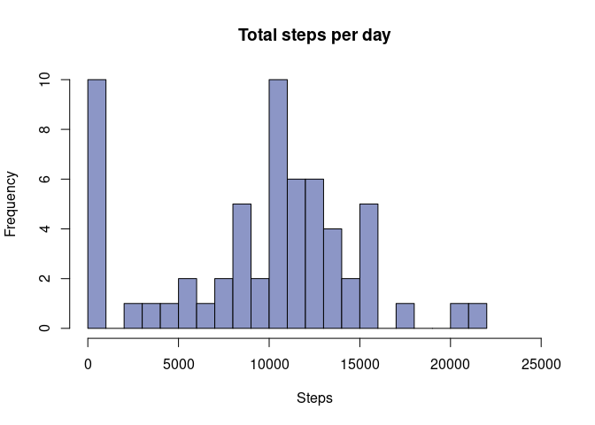
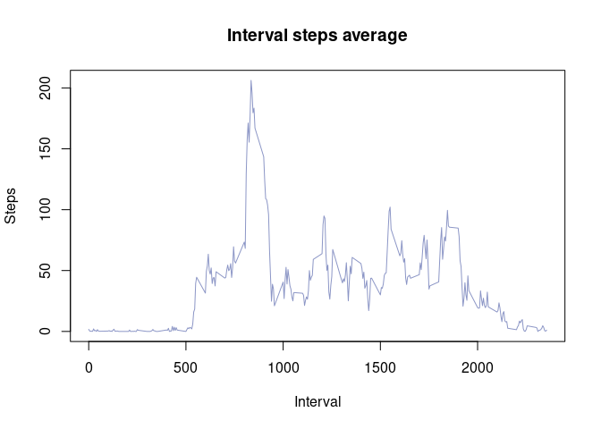
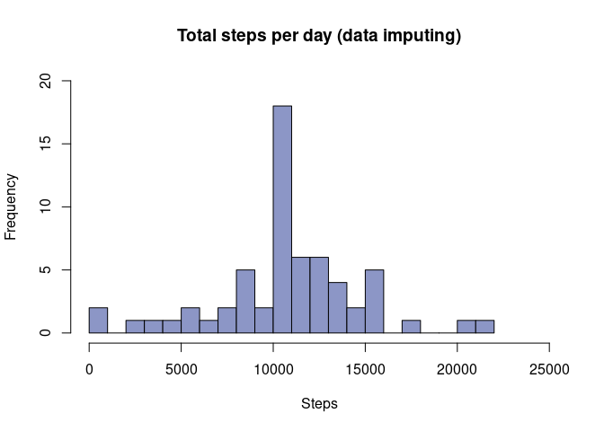

## Loading and preprocessing the data

The activity data represents personal activity measured by a monitoring device. The measurements are taken every 5 minutes during two months, counting the steps of a subject. The variables in the dataset are:

* steps: Number of steps by each 5 minutues.
* date: Measurement date in YYYY-MM-DD format.
* interval: Identifier for the measurement time each day.

First we have to load the activity data in .csv:


```
## Warning in brewer.pal(2, "Set1"): minimal value for n is 3, returning requested palette with 3 different levels
```


```r
act <- read.csv("activity.csv")
da <- as.Date(act$date,"%Y-%m-%d")
```

## What is mean total number of steps taken per day?

Grouping the data by day and plotting a histogram we have:


```r
ts <- act %>% group_by(date) %>% summarize(total = sum(steps,na.rm=TRUE))
hist(ts$total,main="Total steps per day",xlab="Steps",col=co,breaks=20,xlim=c(0,25000),ylim=c(0,10))
```

<!-- -->
The mean and median of total steps per day are:


```
##     Mean   Median 
##  9354.23 10395.00
```
## What is the average daily activity pattern?

The steps average by interval daily, for all the days in the data set is given by:


```r
ai <- act %>% group_by(interval) %>% summarize(average = mean(steps,na.rm=TRUE))
plot(ai$interval,ai$average,type="l",col=co,main="Interval steps average",xlab="Interval",ylab="Steps",xlim=c(0,2355))
```

<!-- -->
The interval of the day in which the maximum amount of steps are taken is:


```r
ai$interval[ai$average==max(ai$average)]
```

```
## [1] 835
```
## Imputing missing values

First is necessary to check the missing values NA in the dataset:


```r
sum(is.na(act$steps))
```

```
## [1] 2304
```
Next, the ```act``` data.frame is copied into ```act2``` for further processing. NA's values will be replaced by the daily average by each corresponding interval via for function. 


```r
act2 <- act
nav <- which(is.na(act2$steps))
for (i in 1:length(nav)){
act2$steps[nav][i] <- ai$average[which(ai$interval == act2[nav,3][i])]
}
ts2 <- act2 %>% group_by(date) %>% summarize(total = sum(steps,na.rm=TRUE))
hist(ts2$total,main="Total steps per day (data imputing)",xlab="Steps",col=co,breaks=20,xlim=c(0,25000),ylim=c(0,20))
```

<!-- -->
The mean and median of total steps per day are:


```
##     Mean   Median 
## 10766.19 10766.19
```
In comparison with the values obtained in the first part, the mean value is increased as well as the median. Low-steps days are less in the processed data ```act2``` due to NA values replaced by mean values of each interval adding up the daily total. The latter shows how the NA's biased the calculations.   


## Are there differences in activity patterns between weekdays and weekends?

In order to differentiate the days is required to add new colums to ```act2``` taking the ```dates``` column. The two columns are: 

* ```day```: Shows which day is the date
* ```week``` : Represents if the day is weekday or weekend as factor


```r
act2 <- act2 %>% mutate(day=weekdays(as.Date(date)))
act2 <- act2 %>% mutate(week=as.factor(ifelse(act2$day=="Saturday"|act2$day=="Sunday","weekend","weekday")))
```
The next plot compares the average steps by interval in weekdays or during the weekends


```r
act3 <- act2 %>% group_by(week,interval) %>% summarize(aw=mean(steps))
plot(act3$interval[act3$week=="weekday"],act3$aw[act3$week=="weekday"],type="l",col=color[1],xlab="",ylab="")
lines(act3$interval[act3$week=="weekend"],act3$aw[act3$week=="weekend"],col=color[2],xlab="",ylab="")
title(main="Average number of steps",xlab="Interval",ylab="Steps")
legend("topright",c("Weekdays","Weekend"),col=color,lty=1)
```

<!-- -->
Is noticeable that in the morning the steps are similar, being higher in weekdays due to work. 
On the other hand, the steps in the weekend are higher than in the weekdays, showing more activity during the day.


